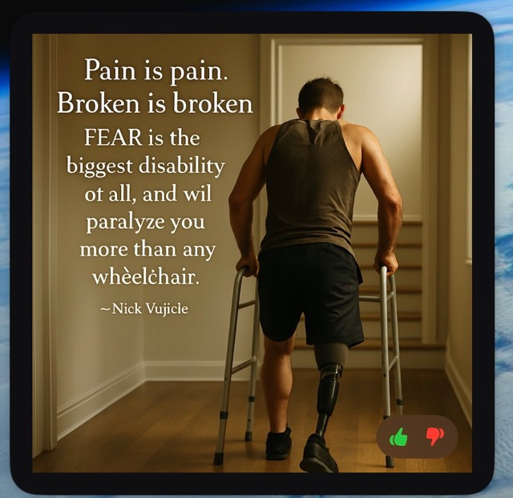
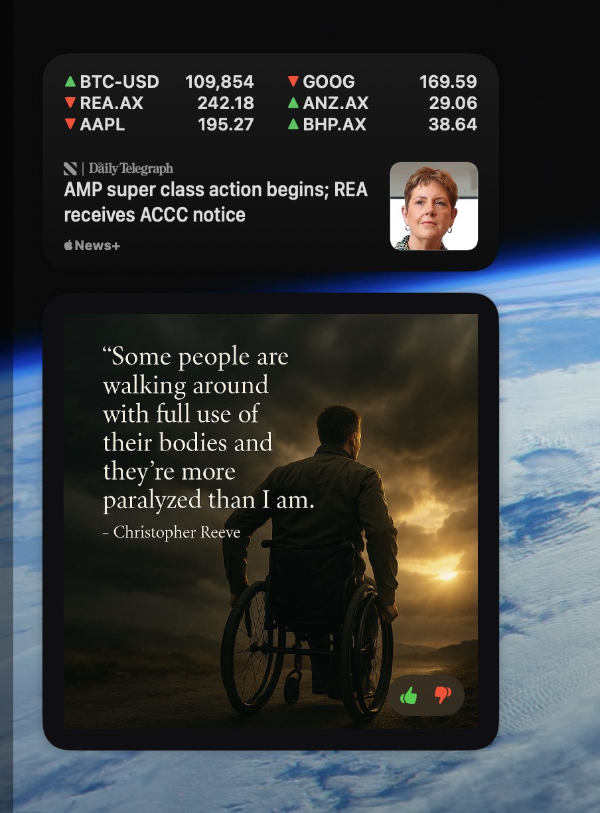
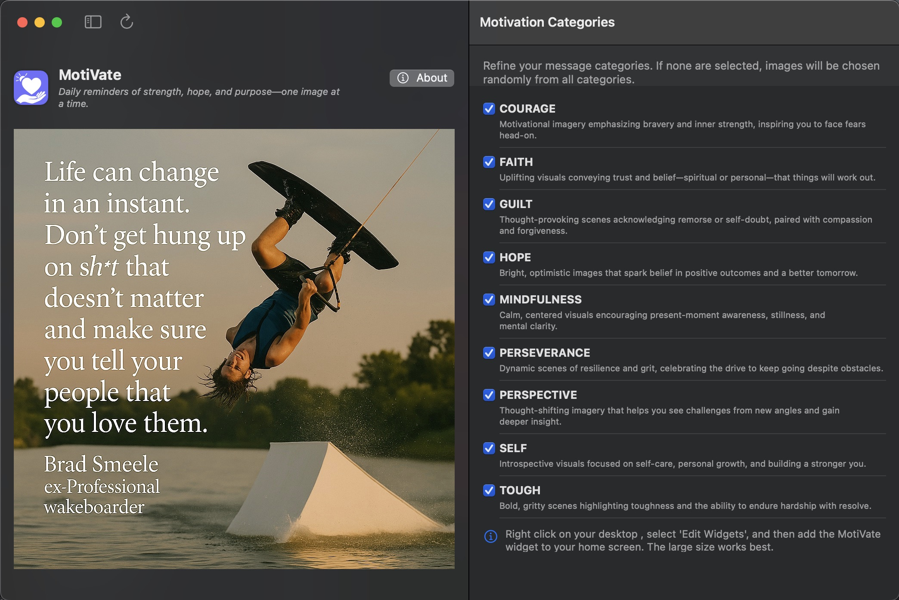
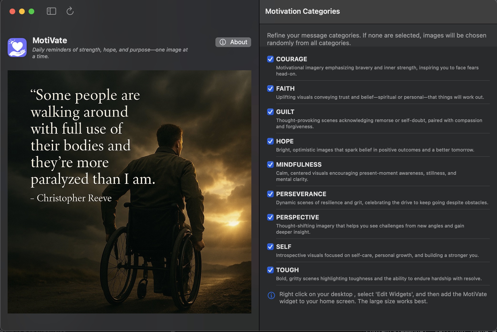
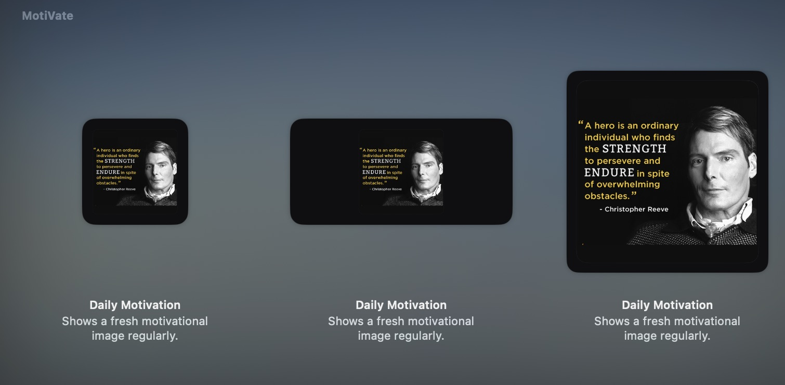
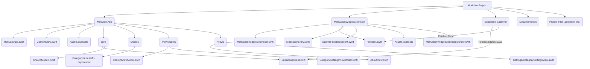

# MotiVate - macOS Motivational Widget

In August of 2022, my life changed forever. What began as a beautiful evening in Paris during a business trip ended with a catastrophic spinal cord injury that left me paralysed from the shoulders down. In an instant, I went from walking through the streets of Paris to fighting for my life on a cold bathroom floor, barely able to breathe or call for help.

What followed was months of survival, surgeries, intensive care, and the long road of rehabilitation. I endured searing pain, trauma, and moments of hopelessness that nearly broke me. But I also discovered something else: the power of the human spirit to endure.

This app was born from that journey. It’s a simple idea—delivering motivational messages to people who might need a little lift. Messages about courage, pain, perseverance, and perspective. Messages that I find helpful on my darkest days.

I’m not here to tell you I have it all figured out. I still struggle. I still live with pain. But I’ve learned that you can survive almost anything if you break it down into small, bearable pieces. This app is my way of sharing that lesson with anyone who needs to hear it.

I built this entire application without the use of my hands—using a head-tracking Bluetooth mouse, voice commands, and assistive tech that helps me code, create, and connect. If you're curious how that works or just want to follow along with the journey, check out my Instagram at the link below.

If one message, one quote, one image helps you get through a hard day—then it’s all been worth it.

— Chris Venter

The application is a macOS widget that displays daily motivational images fetched from Supabase, providing inspiration right on your desktop.

Here are some screenshots of MotiVate in action:

## Application Screenshots

### Desktop Widget Views

*Desktop widget showing a motivational quote*


*Multiple widget sizes on the desktop*

### Main Application Interface

*Main application window with motivational content*


*Category selection and settings interface*

### Widget Gallery

*Available widget size configurations*

## Features

- 📱 macOS Widget Support (Small, Medium, Large sizes)
- 🖼️ Dynamic motivational image loading
- 🎨 Static preview images for widget gallery
- 🔄 Automatic refresh every 1 minutes
- ⚡ Supabase integration for image storage and category data
- ✨ Category-based image filtering for personalized motivation
- ⚙️ In-app settings to select preferred image categories
- 📱 Main application now displays a motivational image based on selected categories
- 🛠️ Debug logging for development
- The ability to rate images with the thumbs up 👍 or thumbs down 👎 buttons (which will eventually impact the likelihood of you seeing those images again)

## Requirements

- macOS 12.0 or later
- Xcode 14.0 or later
- Supabase account and project (for image storage)

## Setup

1. Clone the repository:
   ```bash
   git clone https://github.com/Crypto69/MotiVate.git
   cd MotiVate
   ```

2. Open the project in Xcode:
   ```bash
   open MotiVate.xcodeproj
   ```

3. Configure Supabase:
   - Add your Supabase credentials in `MotiVate/core/SupabaseClient.swift`.
   - Ensure your Supabase storage bucket (`motivational-images`) is set up with appropriate public read permissions.
   - Deploy the necessary database tables (`images`, `categories`, `image_categories`) and the `get_random_image` SQL function to your Supabase project. Refer to `supabase/migrations/` for schema details and the function definition.
 
4. Build and Run:
   - Select the `MotivationWidgetExtensionExtension` scheme
   - Choose "My Mac" as the target
   - Build and run (⌘R)

## Widget Configuration

The widget supports three sizes:
- Small (164x164)
- Medium (344x164)
- Large (344x344)

Each size displays motivational images while maintaining aspect ratio and proper scaling.

## Development

### Project Structure

- `MotiVate/` (Main app target)
  - `Assets.xcassets/`: Application icons, logo, and accent colors.
  - `core/`: Core functionality and shared models
    - `SupabaseClient.swift`: Handles all Supabase interactions (RPC calls, table queries, image feedback).
    - `SharedModels.swift`: Defines shared data structures like `CategoryItem`, `ImageResponse`, and potentially feedback models.
  - `Models/`:
    - `CategoryItem.swift`: (Deprecated, functionality moved to `core/SharedModels.swift`).
  - `ViewModels/`: Contains `ObservableObject` classes for views
    - `CategorySettingsViewModel.swift`: Manages logic for the category selection screen.
    - `ContentViewModel.swift`: Manages logic for the main app's image display and image feedback.
  - `Views/`: Contains SwiftUI views for the main application
    - `ContentView.swift`: The main view of the application, displays an image, provides navigation, and allows image feedback.
    - `AboutView.swift`: Displays application version, author information, and project links (GitHub & Instagram).
    - `Settings/CategorySettingsView.swift`: UI for users to select preferred image categories.
  - `MotiVateApp.swift`: The main entry point for the application.
  - `MotiVate.entitlements`: App entitlements.
- `MotivationWidgetExtension/` (Widget extension)
  - `Assets.xcassets/`: Widget-specific assets, including preview images and icons.
  - `Provider.swift`: Widget data provider, fetches images based on selected categories.
  - `MotivationEntry.swift`: Timeline entry model for the widget.
  - `MotivationWidgetExtension.swift`: Widget view and configuration.
  - `MotivationWidgetExtensionBundle.swift`: Defines the widget bundle.
  - `SubmitFeedbackIntent.swift`: Handles AppIntents for submitting image feedback (e.g., thumbs up/down) directly from the widget.
  - `Info.plist`: Widget extension configuration.
  - `MotivationWidgetExtension.entitlements`: Widget entitlements.

### Project Overview Diagram



### Key Components

- **Provider** ([`MotivationWidgetExtension/Provider.swift`](MotivationWidgetExtension/Provider.swift:0)): Manages widget lifecycle, reads selected categories from `UserDefaults`, and fetches images via RPC.
- **MotivationEntry** ([`MotivationWidgetExtension/MotivationEntry.swift`](MotivationWidgetExtension/MotivationEntry.swift:0)): Data model for widget content.
- **MotivationWidgetEntryView** (within [`MotivationWidgetExtension.swift`](MotivationWidgetExtension/MotivationWidgetExtension.swift:0)): SwiftUI view for widget rendering.
- **SubmitFeedbackIntent** ([`MotivationWidgetExtension/SubmitFeedbackIntent.swift`](MotivationWidgetExtension/SubmitFeedbackIntent.swift:0)): Enables users to provide feedback (e.g., like/dislike) on the displayed motivational image directly from the widget interface using AppIntents.
- **SupabaseClient** ([`MotiVate/core/SupabaseClient.swift`](MotiVate/core/SupabaseClient.swift:0)): Centralizes all communication with Supabase, including fetching category lists, image URLs, and submitting image feedback.
- **CategorySettingsView** ([`MotiVate/Views/Settings/CategorySettingsView.swift`](MotiVate/Views/Settings/CategorySettingsView.swift:0)): Allows users to select their preferred image categories.
- **CategorySettingsViewModel** ([`MotiVate/ViewModels/CategorySettingsViewModel.swift`](MotiVate/ViewModels/CategorySettingsViewModel.swift:0)): Handles the logic for fetching categories, managing user selections, and saving them to `UserDefaults`.
- **ContentViewModel** ([`MotiVate/ViewModels/ContentViewModel.swift`](MotiVate/ViewModels/ContentViewModel.swift:0)): Manages fetching and displaying a motivational image in the main app view, respecting selected categories, and handling image feedback.
- **ContentView** ([`MotiVate/ContentView.swift`](MotiVate/ContentView.swift:0)): The primary interface of the main application. Displays the motivational image, provides navigation to settings and the about screen, and includes controls for image feedback.
- **AboutView** ([`MotiVate/Views/AboutView.swift`](MotiVate/Views/AboutView.swift:0)): Provides users with information about the application, including its version, author details, and project links.
- **SharedModels** ([`MotiVate/core/SharedModels.swift`](MotiVate/core/SharedModels.swift:0)): Contains common data structures like `CategoryItem` (for category data) and `ImageResponse` (for image data from Supabase), used across both the main app and the widget.
- **`MotiVate/Models/CategoryItem.swift`**: (Deprecated, functionality now part of [`MotiVate/core/SharedModels.swift`](MotiVate/core/SharedModels.swift:0)).

### Debug Logging

The widget includes comprehensive debug logging to assist development:
- Provider lifecycle events
- Network requests and responses
- Image loading states
- Error conditions

### Category Filtering
The application now supports filtering motivational images by category:
- Users can access a settings screen within the main MotiVate application to view all available image categories.
- They can select one or more preferred categories. These selections are saved persistently.
- The MotiVate widget reads these saved preferences.
  - If categories are selected, the widget requests an image belonging to one of those categories from the Supabase backend.
  - If no categories are selected (or if preferences haven't been set), the widget displays a random image from the entire collection.
- The main application view also displays a motivational image, respecting the user's category selections.

## Contributing

1. Fork the repository
2. Create your feature branch (`git checkout -b feature/AmazingFeature`)
3. Commit your changes (`git commit -m 'Add some AmazingFeature'`)
4. Push to the branch (`git push origin feature/AmazingFeature`)
5. Open a Pull Request

## License

This project is licensed under the MIT License - see the LICENSE file for details.

## Acknowledgments

- [WidgetKit Documentation](https://developer.apple.com/documentation/widgetkit)
- [Supabase](https://supabase.io/)
- Christopher Reeve Foundation for inspiration


