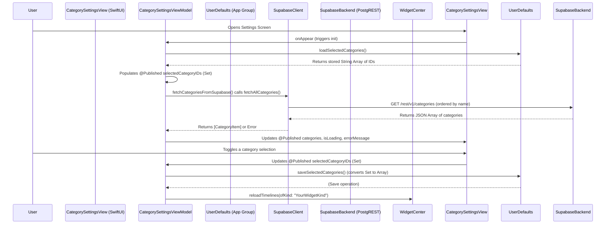

# Plan: Category Fetching & Picker UI for MotiVate App

This document outlines the plan to implement functionality within the main MotiVate application that allows users to select preferred categories. These selections will be saved and used by the MotiVate widget to display category-specific motivational images.

---

## I. Data Model: `CategoryItem`

A Swift struct will represent a category, conforming to `Decodable` (for data from Supabase), `Identifiable` (for SwiftUI lists), and `Hashable` (for use in `Set` collections if needed).

*   **Suggested File:** `MotiVate/Models/CategoryItem.swift`
*   **Definition:**
    ```swift
    import Foundation

    struct CategoryItem: Decodable, Identifiable, Hashable {
        let id: Int64 // Match the 'bigint' type from the Supabase 'categories' table
        let name: String
        let description: String?
        // let created_at: Date? // Optional, if needed from Supabase and for UI
    }
    ```

---

## II. Data Fetching & State Management (ViewModel Approach)

A ViewModel (`CategorySettingsViewModel`) will handle fetching categories from Supabase, managing the state of these categories, user selections, loading status, and any potential errors.

*   **Suggested File:** `MotiVate/ViewModels/CategorySettingsViewModel.swift`
*   **ViewModel Properties:**
    ```swift
    import SwiftUI
    import Combine // For @Published and .sink

    class CategorySettingsViewModel: ObservableObject {
        @Published var categories: [CategoryItem] = []
        @Published var selectedCategoryIDs: Set<String> = [] // Store as Set of String IDs for efficient lookup
        @Published var isLoading: Bool = false
        @Published var errorMessage: String? = nil

        // Constants for UserDefaults
        private let appGroupID = "group.ai.myaccessibility.motivate" // Ensure this matches your App Group ID
        private let userDefaultsKey = "selectedCategoryIDs"
        
        private var cancellables = Set<AnyCancellable>()

        init() {
            loadSelectedCategories()
            
            // Automatically save changes to selectedCategoryIDs
            $selectedCategoryIDs
                .debounce(for: .milliseconds(500), scheduler: RunLoop.main) // Debounce to avoid excessive writes
                .sink { [weak self] _ in
                    self?.saveSelectedCategories()
                }
                .store(in: &cancellables)
        }
        
        // Methods will be defined below
    }
    ```

*   **Fetch Categories Method (within `CategorySettingsViewModel`):**
    This method will call a corresponding method in `SupabaseClient` (to be created).
    ```swift
    // Add to CategorySettingsViewModel
    @MainActor // Ensure UI updates are on the main thread
    func fetchCategoriesFromSupabase() async {
        isLoading = true
        errorMessage = nil
        do {
            // This method needs to be added to SupabaseClient.swift
            let fetchedCategories = try await SupabaseClient.shared.fetchAllCategories() 
            self.categories = fetchedCategories
            self.isLoading = false
        } catch {
            self.errorMessage = "Failed to load categories: \(error.localizedDescription)"
            self.isLoading = false
            print("Error fetching categories: \(error)")
        }
    }
    ```
    *   **Corresponding method in `SupabaseClient.swift`:**
        This method will execute the PostgREST query.
        ```swift
        // Add to MotiVate/core/SupabaseClient.swift
        // public func fetchAllCategories() async throws -> [CategoryItem] {
        //    return try await client.from("categories")
        //                              .select() // Fetches all columns
        //                              .order(column: "name") // As per architecture plan
        //                              .execute()
        //                              .value
        // }
        ```

---

## III. `UserDefaults` Management (within `CategorySettingsViewModel`)

Methods to load and save the user's selected category IDs using App Group `UserDefaults`.

*   **Load Selected Categories:**
    ```swift
    // Add to CategorySettingsViewModel
    private func loadSelectedCategories() {
        guard let userDefaults = UserDefaults(suiteName: appGroupID) else {
            print("Failed to access App Group UserDefaults for suite: \(appGroupID)")
            return
        }
        let stringArray = userDefaults.stringArray(forKey: userDefaultsKey) ?? []
        self.selectedCategoryIDs = Set(stringArray)
        print("Loaded selected category IDs: \(self.selectedCategoryIDs)")
    }
    ```

*   **Save Selected Categories:**
    ```swift
    // Add to CategorySettingsViewModel
    private func saveSelectedCategories() {
        guard let userDefaults = UserDefaults(suiteName: appGroupID) else {
            print("Failed to access App Group UserDefaults for suite: \(appGroupID) for saving.")
            return
        }
        userDefaults.set(Array(self.selectedCategoryIDs), forKey: userDefaultsKey)
        print("Saved selected category IDs: \(self.selectedCategoryIDs) to UserDefaults.")
        
        // Notify the widget to reload its timeline to reflect changes immediately
        // Replace "YourWidgetKindString" with the actual 'kind' string of your widget.
        // import WidgetKit needed for this.
        // WidgetCenter.shared.reloadTimelines(ofKind: "YourWidgetKindString") 
    }
    ```

---

## IV. Settings UI (SwiftUI View)

A SwiftUI view will display the list of categories and allow users to make selections.

*   **Suggested File:** `MotiVate/Views/Settings/CategorySettingsView.swift`
*   **Example Structure:**
    ```swift
    import SwiftUI
    // import WidgetKit // Uncomment if using WidgetCenter.shared.reloadTimelines

    struct CategorySettingsView: View {
        @StateObject private var viewModel = CategorySettingsViewModel()

        var body: some View {
            // Consider embedding in NavigationView if not already part of one
            Form {
                Section(header: Text("Select Categories for Widget")) {
                    if viewModel.isLoading && viewModel.categories.isEmpty { // Show loading only if categories are not yet loaded
                        ProgressView("Loading Categories...")
                    } else if let errorMessage = viewModel.errorMessage {
                        Text("Error: \(errorMessage)")
                            .foregroundColor(.red)
                        Button("Retry") {
                            Task {
                                await viewModel.fetchCategoriesFromSupabase()
                            }
                        }
                    } else if viewModel.categories.isEmpty {
                        Text("No categories available. Check your internet connection or try again later.")
                            .foregroundColor(.gray)
                        Button("Refresh Categories") {
                            Task {
                                await viewModel.fetchCategoriesFromSupabase()
                            }
                        }
                    } else {
                        List { // Use List for better performance with many items
                            ForEach(viewModel.categories) { category in
                                Toggle(isOn: Binding(
                                    get: { viewModel.selectedCategoryIDs.contains(String(category.id)) },
                                    set: { isSelected in
                                        let categoryIDString = String(category.id)
                                        if isSelected {
                                            viewModel.selectedCategoryIDs.insert(categoryIDString)
                                        } else {
                                            viewModel.selectedCategoryIDs.remove(categoryIDString)
                                        }
                                    }
                                )) {
                                    VStack(alignment: .leading) {
                                        Text(category.name).font(.headline)
                                        if let description = category.description, !description.isEmpty {
                                            Text(description).font(.caption).foregroundColor(.gray)
                                        }
                                    }
                                }
                            }
                        }
                    }
                }
            }
            .navigationTitle("Widget Categories") // Assuming this view is pushed onto a NavigationView
            .onAppear {
                if viewModel.categories.isEmpty { // Fetch only if not already loaded
                    Task {
                        await viewModel.fetchCategoriesFromSupabase()
                    }
                }
            }
        }
    }
    ```

---

## V. Integration Steps

1.  **Define `CategoryItem.swift`**.
2.  **Add `fetchAllCategories()` method** to `MotiVate/core/SupabaseClient.swift`.
3.  **Implement `CategorySettingsViewModel.swift`** with all its properties and methods.
4.  **Create `CategorySettingsView.swift`** and integrate it into your main app's settings flow (e.g., as a navigation link from a main settings screen).
5.  **Verify App Group ID and UserDefaults Key:** Ensure `group.ai.myaccessibility.motivate` and `selectedCategoryIDs` are consistently used.
6.  **Widget Reload (Optional but Recommended):**
    *   If you want the widget to update immediately after changing category preferences, uncomment and correctly configure the `WidgetCenter.shared.reloadTimelines(ofKind: "YourWidgetKindString")` line in `saveSelectedCategories()`. You'll need to find the `kind` string from your widget's definition (the struct conforming to `Widget`).

---

## Mermaid Diagram (Data Flow)



---
This plan should guide the implementation of the category selection feature in the main MotiVate application.