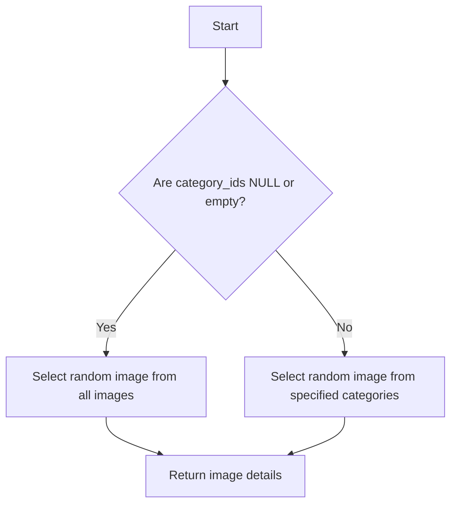

# PostgreSQL Function Implementation Plan: `get_random_image`

Based on the architecture plan and requirements, here's a detailed implementation plan for the PostgreSQL function that will fetch random images by category.

## Function Overview

The function will:
1. Accept an array of category IDs as an optional parameter
2. Return a random image with its details (id, image_url, likes_count, dislikes_count)
3. Fall back to a completely random image if no categories are provided
4. Include basic error handling for invalid inputs

## Function Signature

```sql
CREATE OR REPLACE FUNCTION get_random_image(category_ids bigint[] DEFAULT NULL)
RETURNS TABLE (
    id bigint,
    image_url text,
    likes_count integer,
    dislikes_count integer
) 
LANGUAGE plpgsql
SECURITY DEFINER
```

## Implementation Details

The function will be implemented with the following logic:



### Error Handling

The function will handle these error cases:
1. NULL or empty category_ids array (handled by the fallback logic)
2. Invalid category IDs (will be ignored by the JOIN condition)
3. No images found (will return NULL/empty result)

### SQL Implementation

```sql
BEGIN
    -- If category_ids is NULL or empty array, return random image from all categories
    IF category_ids IS NULL OR array_length(category_ids, 1) IS NULL THEN
        RETURN QUERY
        SELECT 
            i.id,
            i.image_url,
            i.likes_count,
            i.dislikes_count
        FROM public.images i
        ORDER BY random()
        LIMIT 1;
    ELSE
        -- Return random image from specified categories
        RETURN QUERY
        SELECT 
            i.id,
            i.image_url,
            i.likes_count,
            i.dislikes_count
        FROM public.images i
        JOIN public.image_categories ic ON ic.image_id = i.id
        WHERE ic.category_id = ANY(category_ids)
        ORDER BY random()
        LIMIT 1;
    END IF;
END;
```

### Security Considerations

1. Using `SECURITY DEFINER` to ensure the function runs with the privileges of its creator
2. Will grant execute permission to anonymous users since all users of the application are anonymous:
   ```sql
   GRANT EXECUTE ON FUNCTION get_random_image(bigint[]) TO anon;
   ```

## Usage Examples

```sql
-- Get a random image from categories 1 and 2
SELECT * FROM get_random_image(ARRAY[1,2]);

-- Get a completely random image
SELECT * FROM get_random_image();
```

## Integration with Edge Function

While not part of this specific task, this function will later be called from a Supabase Edge Function that will expose the HTTP endpoint as described in the architecture plan:

```
GET /images/random?categories[]=1&categories[]=2
```

The Edge Function will parse the query parameters, call this PostgreSQL function, and return the results.

## Performance Considerations

As mentioned in the architecture plan, ensure appropriate database indexing on `image_categories.category_id` and `images.id` for optimal performance.